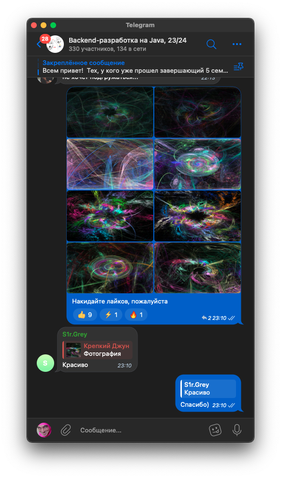

### Среднеее время ускорения
Среднее время работы программы, запущенной на всех ядрах процессовра, сокаращается на ~8000 милисекунд

### Дополнительный функционал
Из дополнительного функционала равлизованы:

    Поддержка цветных изображений

    Логарифмическая гамма-коррекция

    Поддержка параметра симметрии

    Поддержка лайков в группе курса)

